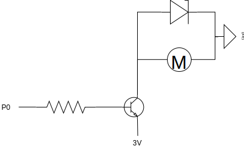

# Moteur à courant continu

Allumer et éteindre un moteur à courant continu.

## Ingrédients

* Basique
** Montrer nombre
* Entrées
** Lorsque le bouton A est pressé
* Logique
* Variables
** Changer `item` pour 1, signifie Ajouter 1 à `item`
* Broches (Avancé)
** Ecrire en analogique la broche P0 à 1023 (Analog write pin P0 to 1023)
* Composants
** Moteur à courant continu
** Transistor NPN
** Diode
** Résistance 1k&Omega;

## Montage

Le transistor joue le rôle d'un interrupteur: lorsque l'électricité passe entre la base B et le collecteur C, l'interrupteur est fermé et le transistor laisse passer le courant entre l'émeteur E et le collecteur C.

On monte une diode en parallèle du moteur pour protéger le transistor.
En effet, lorsque le moteur n'est plus alimenté,
par inertie, il continue de tourner quelques secondes et produit de l'électricité.
Cette tension pourrait endommager le transistor.

## Recette

1. Lorsque le bouton A est pressé, écrire en analogique sur la broche P0, la valeur 1000.
   Lorsque le bouton B est pressé, écrire en analogique sur la broche P0, la valeur 500.
   Observer la vitesse du moteur.
2. Créer un variable `vitesse` qui ira de 0 à 1000 par pas de 200:
* Lorsque le bouton B est pressé et que `vitesse` < 1000, ajouter 200 à `vitesse`
* Lorsque le bouton A est pressé et que `vitesse` > 1000, enlever 200 à `vitesse`
* Ecrire en analogique sur la broche P0, la valeur `vitesse`

## Plus loin

* Utiliser une seconde carte Micro:bit pour commander à distance le moteur
* Démarrer le moteur lorsque la angle de rotation (°) pitch/roll < -45°.
  L'angle de rotation (°) est compris entre -90° et +90°, convertir l'angle en vitesse,
  en faisant par exemple `vitesse=(rotation+90)*1000/90`
